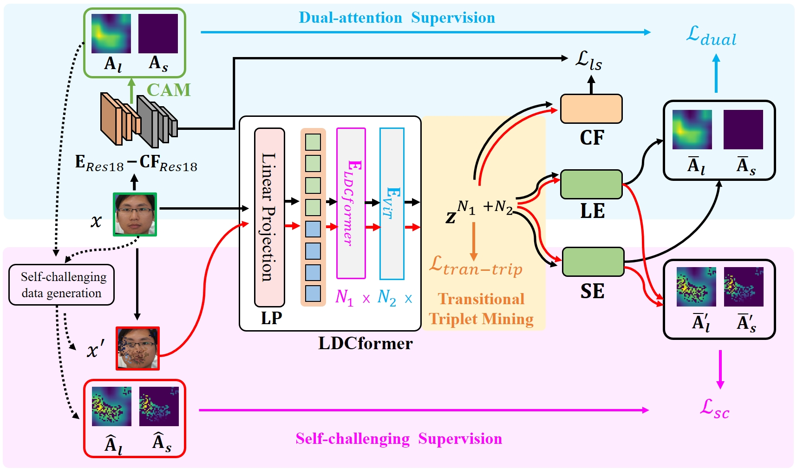

# LDCformer_Ext

### Enhancing Learnable Descriptive Convolutional Vision Transformer for Face Anti-Spoofing via

## Illustration of the architecture of our extended version of LDCformer.


## Requirements
```
grad_cam==1.3.5
matplotlib==3.5.2
numpy==1.22.3
scikit_learn==1.1.2
torch==1.12.0
torchvision==0.13.0
```

## Training
Step 1: run `Amap_train.py` to get pretrained model for producing activation map 

Step 2: run `train.py` to train LDCNet

## Testing
run `test.py`

## Citation

If you use the LDCformer, please cite the paper:

```
@article{huang2024enhancing},
  title={},
  author={},
  year={}
}
```

## Contact us
We are students from MPLAB at National Tsing Hua University.  
Huang, Pei-Kai <alwayswithme@gapp.nthu.edu.tw>  
